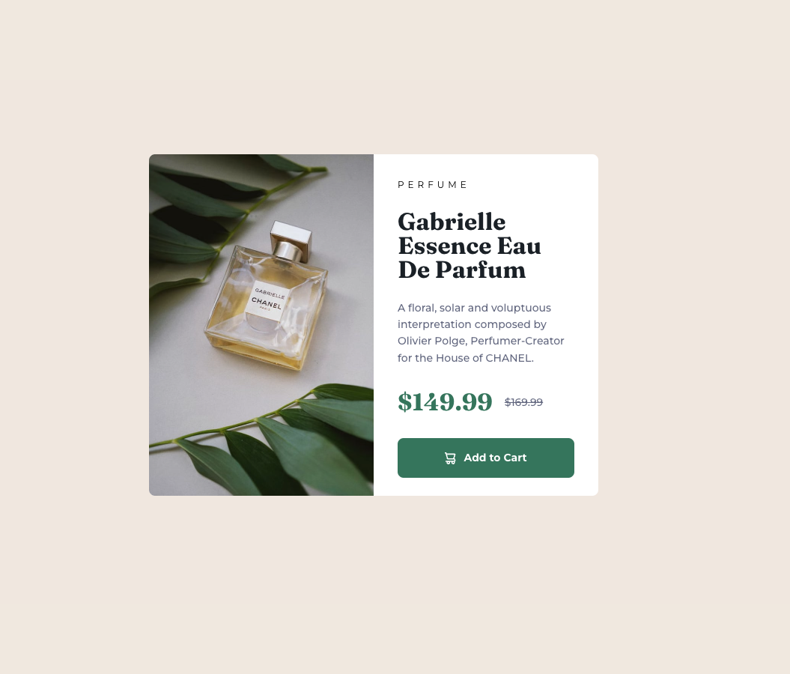

# Frontend Mentor - Product preview card component solution

This is a solution to the [Product preview card component challenge on Frontend Mentor](https://www.frontendmentor.io/challenges/product-preview-card-component-GO7UmttRfa). Frontend Mentor challenges help you improve your coding skills by building realistic projects. 

## Table of contents

- [Frontend Mentor - Product preview card component solution](#frontend-mentor---product-preview-card-component-solution)
  - [Table of contents](#table-of-contents)
  - [Overview](#overview)
    - [The challenge](#the-challenge)
    - [Screenshot](#screenshot)
    - [Links](#links)
  - [My process](#my-process)
    - [Built with](#built-with)
    - [What I learned](#what-i-learned)

## Overview

### The challenge

Users should be able to:

- View the optimal layout depending on their device's screen size
- See hover and focus states for interactive elements

### Screenshot




### Links

- Solution URL: [Add solution URL here](https://your-solution-url.com)
- Live Site URL: [Add live site URL here](https://your-live-site-url.com)

## My process

### Built with

- Semantic HTML5 markup
- CSS custom properties
- Flexbox
- CSS Grid
- Mobile-first workflow

### What I learned

During this project, I enhanced my understanding of responsive design and how to effectively use CSS Flexbox and Grid to create adaptable layouts. I also learned how to implement CSS custom properties for maintaining a consistent design system across the project.

Here are a few specific things I learned:

- **Responsive Design**: I practiced creating layouts that adjust seamlessly to different screen sizes using media queries. This helped me understand the importance of a mobile-first approach.

- **CSS Flexbox and Grid**: I used Flexbox for aligning items in a row and Grid for more complex layouts. This combination allowed me to create a flexible and responsive design.

- **CSS Custom Properties**: By using CSS variables, I was able to maintain consistency in colors and spacing, making it easier to update the design globally.

Here's a code snippet that I'm particularly proud of:

```css
.container {
  display: flex;
  flex-direction: column;
  align-items: start;
  justify-content: center;
  min-height: 100vh;
  box-sizing: border-box;
}
```
